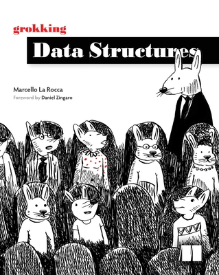

# 資料結構與演算法
- 講師：林志偉
- 教材：https://github.com/mingfujacky/Lecture-Data-Structure.git

# Textbook

- Grokking Data Structures
- La Rocca, Marcello
- Manning, 2024

# 課程講師 - 林志偉 (Jacky Lin)

- #### 現職: 陽明交通大學 / 學士後電子與光子學士學位學程 助理教授
- #### 學歷: 交大資訊管理博士
- #### 經歷: 台積電資訊科技(IT)
- #### 專長: 資料工程、程式設計、巨量資料分析
- #### Email: jacky.jw.lin@nycu.edu.tw

# 課程助教
蔡孟哲 (aayy0917.sc13@nycu.edu.tw)

# 課程規劃
- #### 課程目標
  *-* Introduce basic data structures that every programmer needs to know.
  *-* Use Python to implement basic algorithms to sharpen coding skill.

- #### 授課方式
  - 教材講解
  - 課堂 Lab 實作 (上課請攜帶電腦)
  - Deliver final project in group or individual. The project topic is related to data structures and algorithms. For example,
    - 成績管理系統 / 圖書管理系統 / 井字遊戲 / Undo-redo
    - 迷宮 / Huffman 編碼 / 排序演算法比較 / 抄襲檢測 / 社交網路分析

# 評分方式
- Attendance(10%): 5 roll calls 
  - 2 points for full attendance
  - 1 point for excused absence (with approved leave)
  - 0 point for unexcused absence
- Homework (30%): 6 assignments will be given (late submissions will not be accepted)
- Mid-term exam (20%): closed-book written exam, covering the first half of the course.
- Final-term exam (20%): closed-book written exam, covering the entire course.
- Project (20%): live demo + algorithm explanation + complexity analysis
  - (10%) Final report oral presentation: Week 15
  - (10%) Submit final written report by Week 17 (don't be late)

# 授課大綱
[114上學期](https://timetable.nycu.edu.tw/?r=main/crsoutline&Acy=114&Sem=1&CrsNo=520016&lang=)

# 時時實際操作
 
>我鼓勵你使用鍵盤手動複製這些程式，而不是直接將其原始程式碼複製貼上到新檔案中；這有助於你對程式產生「肌肉記憶」，並迫使你在鍵入時考慮每一行。

