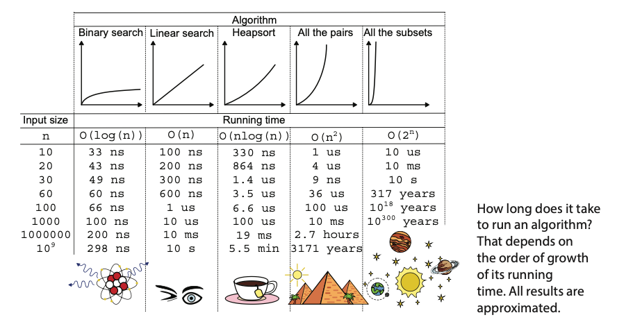

# Big-O Notation: A Framework for Measuring Algorithm Efficiency


# Measure Terms of Algorithm Performance
- Time complexity
- Memory space complexity

# Measure Methods of Algorithm Performance
**[Profiling 效能分析]** Implement the algorithm and run code on various **inputs** to measure time and memory it takes. <br>
```python
from time import time
start time = time()
# run algorithm here
end time = time()
elapsed = end time− start time
```
**[Asymptotic Analysis 漸近分析]** Find mathematical formulas that describe how an algorithm behaves **as a function of its <u>input</u>**.


# Asymptotic Analysis - Calculate Operations of an Algorithm
```python
def add_up_to(n):
    sum = 0                  # 1 op
    for i in range(1, n+1):  # n ops
        sum += i             # n ops 
    return sum               # 1 op
# total: (2n + 2) ops  => O(n)
```
```python
def add_up_to(n):
    return (1 + n) * n / 2   # 1 op
# total:  1 op, regardless of the size of n  => O(1)
```

# Big-O Classify Growth Rate
- Big-O notation is to **<u>classify</u>** algorithm's performance (complexity) grow as the <u>input size n</u> grows.


# Big-O Definition
- f(n): a function of algorithm's running time, n is input size
- Find two linear functions (n, n/2) as a pair to bound f(n), when n is large enough (eg. 3)
- Define **O(n)** is a class of functions which grow as linear, like n, 10n, n/10
- Since n, n/2 belongs to O(n), we write **<u>f(n)=O(n)</u>**, means f(n) belongs to O(n) class
<div class="middle-grid">
    
    
</div>

# Big-O Concept
Based on the definition of Big-O notation, f(n) = O(n), we do not care which line pair can bound f, as long as there is one pair when n is large enough.
<div class="middle-grid">
    
    
</div>

# Asymptotically Equivalent
- For asymptotic analysis, two lines are considered asymptotically equivalent
    - Two functions f(n) = n and g(n) = 3n are considered equivalent because their growth is of the same order of magnitude (同一個量級)
    - We say they belong to the same Big-O, O(n)
- When comparing two algorithms, we compare their Big-O respectively.

# Four Rules to Find Big-O of an Algorithm
- Rule 1: Worst case
- Rule 2: Remove the constants
- Rule 3: Different inputs use different variables

```python
n = 9  # 1 op
m = 9  # 1 op
for i in range(n):         # Outer loop: n ops
    for j in range(m):     # Inner loop: m ops
        print(i, j)        # 1 op
# The summary of ops is n * (1 + (2 * m)) + 2. 
# The algorithm is  O(n + 2 * n * m + 2), n and m represent independent inputs. 
```
- Rule 4: Drop nondominant terms: We will get O(n * m)
**[Question]** Find Big O of an algorithm having time complexity 20n³ + 5n + 7 => O(n³)
https://dev.to/coderjay06/four-rules-for-big-o-1915

# The Big O of Linear Search
```python
def linear_search(self, target):
    for i in range(self._size):      # repeat n times
        if self._array[i] == target: # 1 op
            return i                 # 1 op
        elif self._array[i] > target:# 1 op
            return None              # 1 op
    return None                      # 1 op
```
- The formula for the running time of linear search is 
  T(n) = n * (1 + 2 ) + 1 = 3n +1 = O(n)

# The Big O of Binary Search
```python
def binary_search(self, target):
    left = 0                              # 1 op
    right = self._size - 1                # 1 op
    while left <= right:                  # repeat log2(n) times
        mid_index = (left + right) // 2     # 1 op
        mid_val = self._array[mid_index]    # 1 op
        if mid_val == target:               # 1 op
            return mid_index                # 1 op
        elif mid_val > target:              # 1 op
            right = mid_index - 1           # 1 op
        else
            left = mid_index + 1            # 1 op
    return None                             # 1 op
```
- The formula for the running time of binary search is
  T(n) = 2 + log<sub>2</sub>n*(6) + 1 = log<sub>2</sub>6n + 3 = O(log<sub>2</sub>n)

# Another 2 Notation of Algorithm Complexity
Case Type|Description|Notation
---------|-----------|--------
Worst Case|The maximum time the algorithm will take for any input. Analyzes the most unfavorable scenario. Usually the primary focus.|O(...)
Average Case|The expected time over all possible inputs. More complex to analyze, as it requires averaging over all input cases.|&Theta;(...)
Best Case|The minimum time the algorithm will take for any input. Represents the most favorable input scenario.|&Omega;(...)

# Complexity of Linear Search Algorithm
Case|Time Complexity
----|---------------
Best|&Omega;(1) (target is first item)
Avg|&Theta;(n)
Worst|O(n) (target is last or not found)

# Recap
- To evaluate performance of an algorithm, we can use asymptotic analysis, which means finding out a formula, expressed in big-O notation
- Big-O notation is used to classify functions based on their asymptotic growth. We use these classes of functions to express how fast the running time or memory used by an algorithm grows as the input becomes larger.
- Most common classes of functions
  – O(1): **constant**, sum up 1 to n
  – O(log<sub>2</sub>(n)): **logarithmic**, binary search
  – O(n): **linear**, linear search
  – O(n*log<sub>2</sub>(n)): **linearithmic**, priority queues
  – O(n<sup>2</sup>): **quadratic**, all pairs in an array.
  – O(2<sup>n</sup>): **exponential**, all subsets of an array